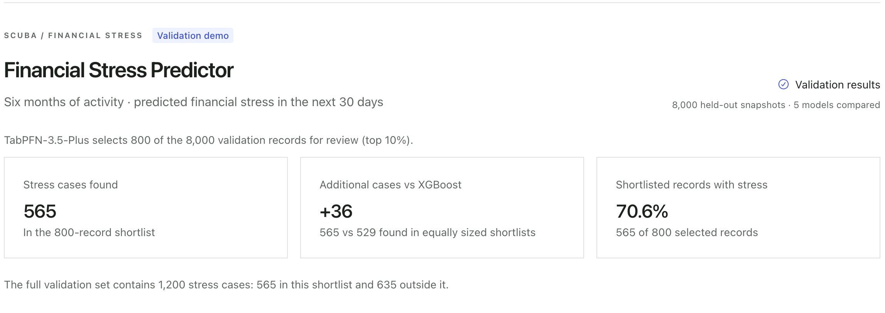
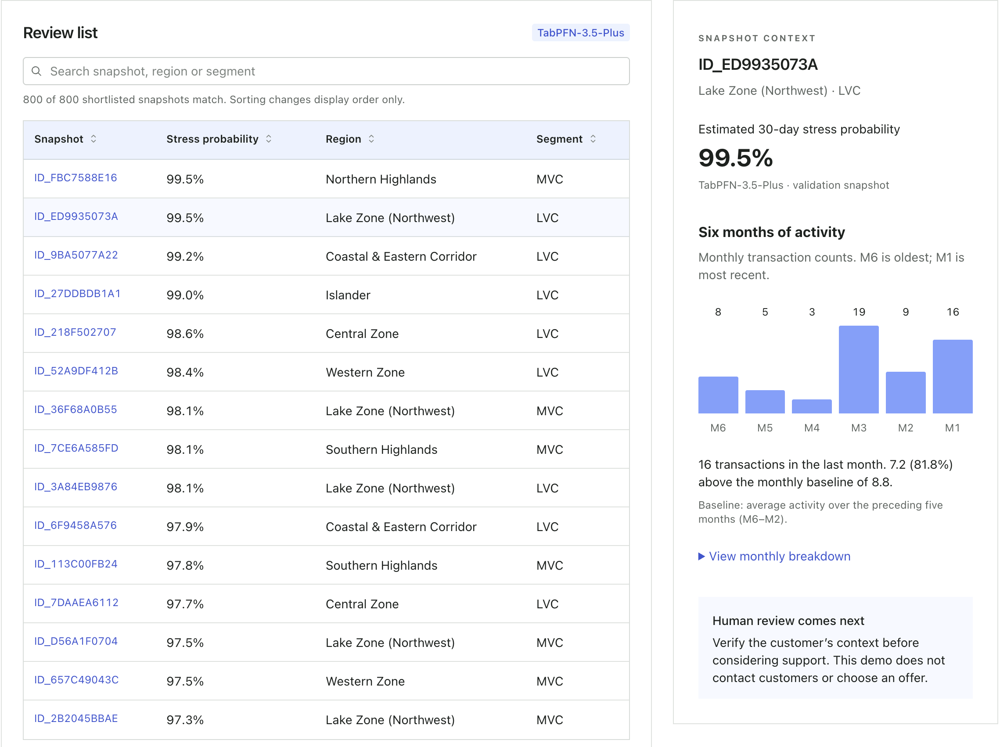
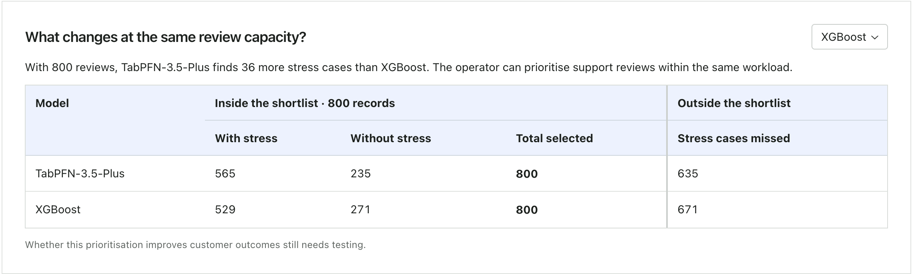
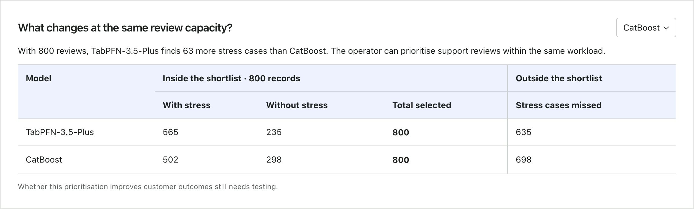

# SCUBA · Financial Stress Predictor

**Find more financial-stress cases within the same customer-care review workload.**

SCUBA uses TabPFN-3.5-Plus to rank records for human review. The model receives
182 inputs: six months of transaction counts, amounts and balances, alongside
activity frequency and customer profile information. An operator chooses a
review capacity, inspects individual activity and exports a shortlist.

Built for the Prior Labs TabPFN-3.5 Hackathon. The working app is the entry;
the model comparison shows why TabPFN is central to it.

## What TabPFN adds

On the reserved **8,000-record final holdout**, TabPFN found **542 stress cases**
in an **800-record shortlist**. XGBoost found **512** at the same capacity:
**30 additional cases without increasing the review workload**.

| Model | Log loss ↓ | AUROC ↑ | Stress cases found in 800 records |
| --- | ---: | ---: | ---: |
| TabPFN-3.5-Plus | **0.2799** | **0.8784** | **542** |
| XGBoost | 0.3073 | 0.8560 | 512 |
| CatBoost | 0.3300 | 0.8384 | 472 |
| Logistic regression | 0.3806 | 0.7410 | 352 |
| Constant prior | 0.4227 | 0.5000 | 126 |

Lower log loss means better probability estimates; higher AUROC means better
ranking. All five models used the same 24,000 training records and fixed settings.
The final holdout contains 1,200 stress cases. TabPFN's shortlist includes 542
records with stress and 258 without; 658 stress cases remain outside it.

A post-hoc paired bootstrap gives a 95% interval of **9–50 additional cases**
versus XGBoost, assuming independent records. See the [final results](docs/F4_RESULTS.md)
and [uncertainty analysis](docs/F4_UNCERTAINTY_RESULTS.md).

## Try the workflow

Follow the [setup and run guide](docs/how-to/FINANCIAL_STRESS.md#run-the-saved-demo).
The packaged dashboard uses saved predictions and needs no API key.

1. Open **Final holdout** to compare models at the same 400- or 800-record capacity.
2. Open **Review workspace** to inspect the ranked validation records and their activity.
3. Export the selected shortlist for a customer-care review.

The workspace uses a separate validation sample, where TabPFN finds **565** cases
in 800 records. That is why its count differs from the final holdout's **542**.
The app does not contact customers or choose a support offer.

*Validation results at an 800-record review capacity.*

*Select a record to inspect its recent activity against its own baseline before
considering support.*

Compare models at the same review capacity (validation)

TabPFN finds **36 more stress cases than XGBoost** and **63 more than CatBoost**
in equally sized 800-record validation shortlists.

## Reproduce the evidence

The [run guide](docs/how-to/FINANCIAL_STRESS.md) covers locked dependency setup,
offline demo rebuilding, local model evaluation and optional hosted execution.
To run a new TabPFN prediction, [get your own Prior Labs API key](docs/how-to/FINANCIAL_STRESS.md#get-your-own-prior-labs-api-key).
Python 3.14.5 and Node 24 are the verified runtimes. Initial dependency installation
requires network access unless packages are cached; demo replay is offline.

The release includes the original Financial Stress inputs, saved predictions,
checksums and tests. Rebuilding verifies the evidence and recomputes the displayed
results. Replaying saved predictions does not rerun the hosted model.

## Data and limits

The source is the [Zindi Financial Stress Prediction Challenge, September edition](datasets/financial-stress/README.md).
The target is its supplied 30-day liquidity-stress label. Dates and persistent
customer identifiers are absent, so the evaluation separates rows; it cannot
establish future performance or separation between people. The dataset's
real/synthetic origin and operational definition of stress remain unverified.

This prototype demonstrates review prioritisation. Whether that prioritisation
improves customer outcomes needs an operator pilot. See the
[method and limitations](docs/FINANCIAL_STRESS_METHOD.md).

Original code and documentation are Apache-2.0. Source data and adaptations retain
the declared CC BY-SA 4.0 licence and attribution. See [licence scope](LICENSE_SCOPE.md)
and [data provenance](DATA_PROVENANCE.md).

## Explore

- [Documentation guide](docs/README.md)
- [Two-minute recording walkthrough](docs/FINANCIAL_STRESS_WALKTHROUGH.md)
- [Hackathon project description](docs/PRIOR_LABS_SUBMISSION_DRAFT.md)
- [Earlier synthetic benchmark](docs/SYNTHETIC_ARCHIVE.md)
